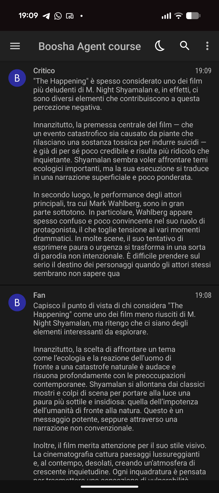

# ep01_primo_agente

> Prima di iniziare: [creare le chiavi API](../Extra/chiavi-api.md) · [ambiente Python con uv](../Extra/ambiente-python-uv.md)

Il tuo primo agente con Microsoft Agent Framework: poche righe di codice, eseguito su OpenAI e poi - stesso codice - in locale con Ollama.

Nel notebook costruiamo l'agente passo passo:

- **setup** cross-platform (Colab o VS Code) con env-detection e chiave OpenAI;
- **il primo agente**: un LLM con un ruolo, eseguito dal runtime;
- **streaming**: la risposta che appare man mano;
- **stesso agente in locale** con Ollama, cambiando solo il chat client;
- **verso il Debate Club**: due personalità diverse sulla stessa motion, giocando sulle `instructions`;
- **far uscire l'output** dal notebook con una notifica push (Pushover);
- **dal notebook al terminale**: lo stesso agente come programma vero (`agente.py`).

Contenuto della puntata:

- `pratica.ipynb` - notebook eseguibile (Colab o Jupyter in locale)
- `agente.py` - script da terminale

## Risultato

