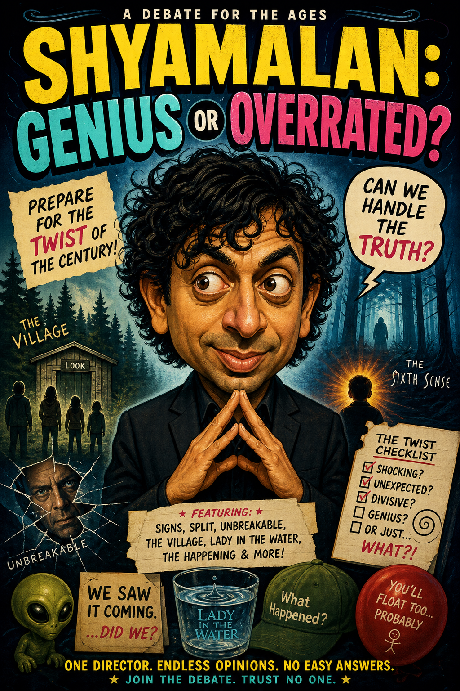

# ep02_tools_mcp

> Prima di iniziare: [creare le chiavi API](../Extra/chiavi-api.md) · [ambiente Python con uv](../Extra/ambiente-python-uv.md)

Dai strumenti a un agente: l'Opinionista di EP 1, che sa solo dare pareri, prende un tool alla volta e diventa un Ricercatore che costruisce il dossier di un film. Tool concreti e MCP, non giocattoli.

Nel notebook lo costruiamo passo passo:

- **l'agente senza mani**: l'Opinionista, il punto di partenza - sa opinare ma non agire;
- **il primo tool** (`@tool`): una notifica push (Pushover), che ora è l'agente a decidere quando usare;
- **tool hosted**: il code interpreter per fare i conti, con `mostra_tool_usati` per vedere cosa ha invocato;
- **MCP + browser**: Playwright come tool per *vedere* una pagina e portarne uno screenshot-prova (`allowed_tools`, approvazione);
- **cercare i fatti**: Wikipedia per filmografia e numeri (`cerca_filmografia` + `cerca_dati_film`);
- **cercare le opinioni**: recensioni su domini fidati con Tavily (`cerca_recensioni`);
- **output strutturato**: il `DossierFilm` con Pydantic (tool e `response_format` insieme);
- **il Ricercatore**: mette insieme i tool e costruisce il dossier del film - niente verdetto, è il contratto per il Debate Club di EP 4;
- **bonus**: la **locandina** del film generata con l'image generation;
- **dal notebook al terminale**: lo stesso flusso come programma vero (`agente.py`), con il log di ogni step.

Contenuto della puntata:

- `pratica.ipynb` - notebook eseguibile (Colab o Jupyter in locale)
- `agente.py` - script da terminale

## Bonus locandina

Questo è il mio risultato! Condividi il tuo sui nostri social.

