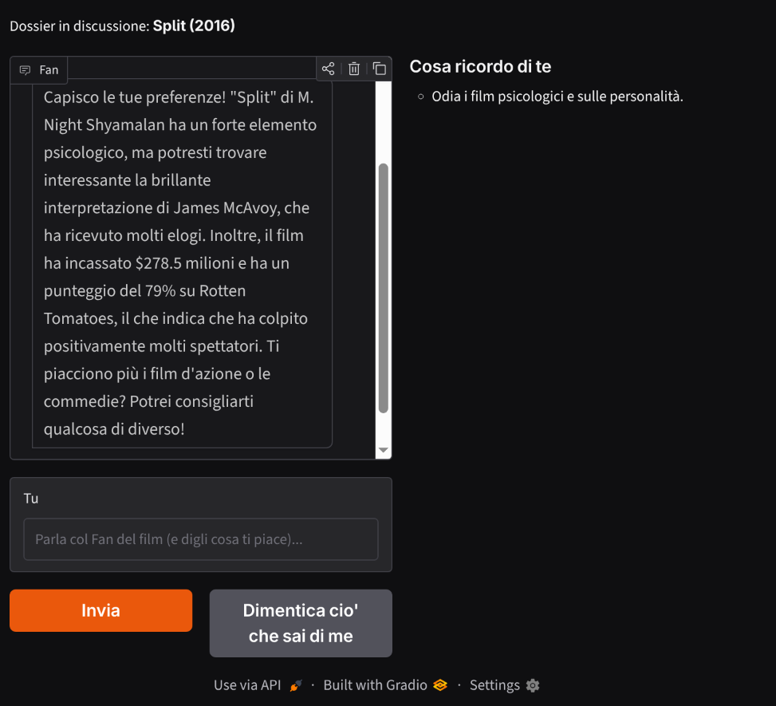

# ep03_memoria_stato

[](https://colab.research.google.com/github/boosha-ai/boosha-agentic-corso-maf/blob/main/maf/ep03_memoria_stato/pratica.ipynb)

> Prima di iniziare: [creare le chiavi API](../Extra/chiavi-api.md) · [ambiente Python con uv](../Extra/ambiente-python-uv.md)

Un agente riparte da zero a ogni chiamata: gli diamo la memoria. Il Fan del Debate Club impara a ricordare dentro una conversazione, a ricordare **chi sei** tra una conversazione e l'altra, e a **compattare** la storia quando non entra più nel contesto. Tre livelli veri, non un trucco da chatbot.

Nel notebook lo costruiamo passo passo:

- **il materiale**: i quattro dossier che il Ricercatore di EP 2 ha prodotto, caricati da file - il Fan non cerca dati, argomenta su quelli che gli dai;
- **il problema**: due `run` di fila, e alla seconda l'agente non sa più di cosa parlavate;
- **livello 1, la sessione** (`create_session()`): il filo di *una* conversazione;
- **livello 2, la memoria di te** (`ContextProvider`): `before_run` inietta il profilo, `after_run` estrae dallo scambio i gusti duraturi e li scrive su file. Se il profilo è vuoto, il Fan te li chiede - come Netflix al primo accesso;
- **la prova che non è un pappagallo**: stesso film, due profili opposti, due difese diverse;
- **il memory harness** (`MemoryContextProvider`, experimental): la stessa cosa già pronta, con `MEMORY.md` e un file per argomento su disco - e si vede **dove** salva, path in base64 compresi;
- **il confine**: dove si attacca la memoria vettoriale, e perché qui non serve;
- **livello 3, la compaction** (`apply_compaction` + `SummarizationStrategy`): 16 messaggi diventano 3, un riassunto più l'ultimo turno intatto;
- **bonus**: il Fan che ti conosce tra film diversi, in sessioni diverse.

Poi, da terminale, **il compagno di cinema** (`agente.py`): una piccola interfaccia dove scegli o carichi il dossier di un film, chatti col Fan e vedi il pannello "cosa ricordo di te" riempirsi mentre parlate. Chiudi il programma, lo riapri, e ti riconosce.

```bash
uv run python agente.py
```

Si apre nel browser da solo. Serve `OPENAI_API_KEY` nel `.env` (vedi `SETUP.md`). Se lavori da remoto, dove `127.0.0.1` non è raggiungibile dal tuo browser, aggiungi `--share` per avere un link temporaneo:

```bash
uv run python agente.py --share
```

Il profilo che l'agente si costruisce su di te è un file di testo nella cartella dell'episodio: aprilo, è la parte più istruttiva. Il pulsante "Dimentica ciò che sai di me" lo cancella, se vuoi ripartire dal primo incontro.

Contenuto della puntata:

- `pratica.ipynb` - notebook eseguibile (Colab o Jupyter in locale)
- `agente.py` - script da terminale

## Il Fan che si ricorda di te

Questo è il mio compagno di cinema dopo qualche chiacchierata: a destra il pannello "cosa ricordo di te", che è solo un file di testo riletto a ogni run. Chiudi il programma, lo riapri, e ti riconosce.

Prova tu: fagli difendere un film che detesti, e guarda cosa succede al pannello. E quando vuoi tornare estraneo, c'è il pulsante. Condividi il tuo risultato sui nostri social.



